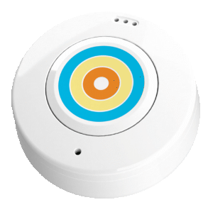

[](https://ticatag.com)

## Prerequisites
To use this SDK, you need to use the Ticatag TibeConnect button.
You can buy this button online [here](http://www.ticatag.com/categorie-produit/b2c)

## About TiBeConnect Kit for Android 

This Kit provides all the capabilities to manage the TiBeConnect button:
- Scan buttons around you
- Button connection / reconnection
- Button RSSI
- Button buzzer
- Button clicks (simple, double, long press) change notification
- Mode button : with this mode the button is placed in standby and is awake only when movement is detected on the button. This feature will drastically increase button battery life.
- Button firmware version

## Getting started
You can download this sample to test TibeaconConnect SDK.

## Download
Gradle

```javascript
dependencies {
  compile 'com.ticatag.tibeaconconnect:tibeaconconnect:0.3.0'
}
```

## init TibeaconConnect Manager
To init the TibeaconConnect you just need to create instance with the context and choose to start the background service.
The SDK can check the permission for you with the second line in this exemple
```
    @Override
    protected void onCreate(Bundle savedInstanceState) {
        tiBeaconConnectManager = TiBeaconConnectManager.create(this, true);
        tiBeaconConnectManager.checkPermission(this);
    }
    
    
    @Override
    public void onRequestPermissionsResult(int requestCode, @NonNull String[] permissions, @NonNull int[] grantResults) {
        super.onRequestPermissionsResult(requestCode, permissions, grantResults);
        tiBeaconConnectManager.onRequestPermissionsResult(requestCode, permissions, grantResults);
    }
    
```

## Scan devices
You have three choice to scan device with this SDK:
- With the background service (TicatagService)
- Direct Scan
- scan for attach device


### Ticatag Service :
The service scan in background and automatically connects to the device if his mac address is in the list.
After that a broadcast intent was emitted with de mac address and the status of connection (the same case is use for the disconnection).

For add a device in auto connection list you must use this function :
```
    tiBeaconConnectManager.addDeviceToConnect("F8:40:3C:6A:1C:34");
```


##### Device Status
###### AndroidManifest.xml : 
```
    <receiver android:name=".application.StatusConnectBroadCastReceiver">
        <intent-filter>
            <action android:name="com.ticatag.sample.TicatagService.CONNECTED" />
            <action android:name="com.ticatag.sample.TicatagService.DISCONNECTED" />
        </intent-filter>
    </receiver>
```
To declare the receiver intent filter you need to use your package and only add the service you need to use : TicatagService.CONNECTED

###### Your receiver :
```
public class StatusConnectBroadCastReceiver extends StatusConnectBroadcastReceiver {

    @Override
    protected void receiveCommand(Context context, String macAddress, Status status) {
        Log.d(TAG, "StatusConnectBroadCastReceiver : macAddress : " + status);
        
    }

}
```
for receive the the value of stats you need to implement your Broadcast receiver and extends StatusConnectBroadcastReceiver.

##### Device Action
The same case for the click button action you receive directly the action in BroadCast receiver.
###### AndroidManifest.xml : 
```
    <receiver android:name=".application.ButtonClickBroadCastReceiver">
        <intent-filter>
            <action android:name="com.ticatag.sample.TicatagService.ACTION_BROADCAST" />
        </intent-filter>
    </receiver>
```
###### Your receiver :
```
public class ButtonClickBroadCastReceiver extends ActionBroadcastReceiver {
    @Override
    protected void receiveCommand(Context context, String macAddress, TiBeEventType tiBeEventType) {
        Log.d(TAG, "StatusConnectBroadCastReceiver : macAddress : " + tiBeEventType);
    }
}

```


### Direct Scan :
Is use to scan and get the result directly in activity. 
For use this method the activity must be implement BeaconConsumer and bind in tiBeaconConnectManager.
```
public class MainActivity extends AppCompatActivity implements BeaconConsumer{

        @Override
        protected void onStart() {
            super.onStart();
            tiBeaconConnectManager.bindDeviceScan(this);
        }
    
        @Override
        protected void onStop() {
            super.onStop();
            tiBeaconConnectManager.unbindDeviceScan(this);
        }
}
```

To receive all devices around the Android phone : 
```
    @Override
    public void unbindService() {
        tiBeaconConnectManager.scanTibeaconAround(false);
    }

    @Override
    public void bindService(int mode) {
        btAttach.setEnabled(true);
        btscan.setEnabled(true);
    }

    @Override
    public void onBeaconsInRange(List<TicatagBeacon> beacons) {
        Log.d("onBeaconsInRange" , "size : " + beacons.size());
    }
    
    @OnClick(R.id.bt_main_scan_beacon)
    void scan(){
        tiBeaconConnectManager.scanTibeaconAround(toogleScan);
    }
    
    
```


### Scan for attach device :
This function scan during a period and return only one device, is use to attach device in a user account.
```
    tiBeaconConnectManager.scanForAttachDevice(15000, false, false, new OnAttachBeaconScanCallback() {
            @Override
            public void OnBeaconResultAttach(TicatagBeacon ticatagBeacon) {
                Log.d("OnBeaconResultAttach" , "the device : " + ticatagBeacon.getBluetoothAddress());
            }

            @Override
            public void onError(Error errorCode) {

            }
        });
```


## Issues
 For general service questions and help consult the Ticatag  [support knowledge base](https://ticatag.zendesk.com/).

If you've found a problem in this library, perform a search under
[Issues](https://github.com/Ticatag/TibeaconConnect/issues)
in case it has already been reported. If you do not find any issue addressing it, feel free to [open a new
one](https://github.com/Ticatag/TibeaconConnect/issues/new).

Your issue report should contain a title and a clear description of the issue at a minimum. Please provide as much relevant information as possible to replicate the issue. This should include the Java and library versions, a code
sample demonstrating the issue, and device OS information. Providing a unit test that demonstrates the issue is greatly appreciated. Your goal should be to make it easy for yourself - and others - to replicate the bug and figure out a
fix.

## License

    Copyright 2017 Ticatag

    Licensed under the Apache License, Version 2.0 (the "License");
    you may not use this file except in compliance with the License.
    You may obtain a copy of the License at

       http://www.apache.org/licenses/LICENSE-2.0

    Unless required by applicable law or agreed to in writing, software
    distributed under the License is distributed on an "AS IS" BASIS,
    WITHOUT WARRANTIES OR CONDITIONS OF ANY KIND, either express or implied.
    See the License for the specific language governing permissions and
    limitations under the License.


## library
All library use in this SDK :
```
    compile 'com.google.dagger:dagger:2.10'
    annotationProcessor 'com.google.dagger:dagger-compiler:2.10'

    compile 'com.polidea.rxandroidble:rxandroidble:1.2.2'
    compile 'no.nordicsemi.android:dfu:1.3.0'
```